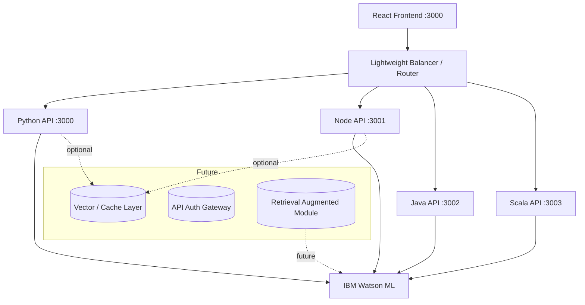
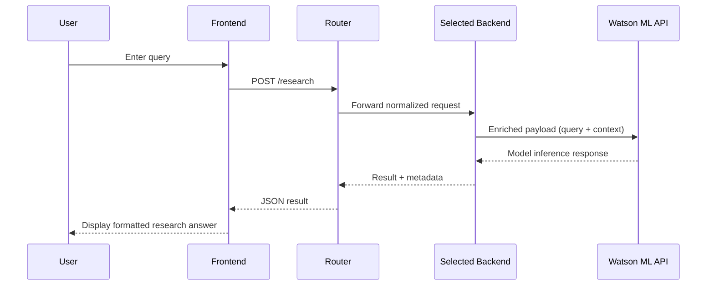
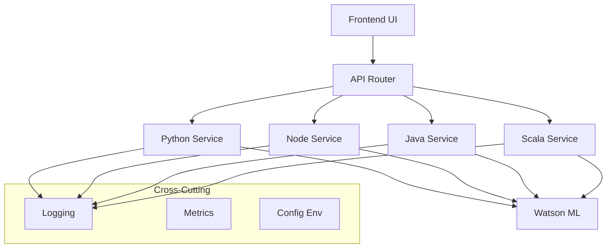

# 🤖 Watson ML Research Agent

> A polyglot, multi‑backend AI research platform integrating IBM Watson Machine Learning to deliver fast exploratory answers, deeper conversational insights, and scalable enterprise readiness.

[PPTX Overview (Architecture & Pitch)](https://1drv.ms/p/c/17d9834b0fdee341/Ea4q6xrXTepIh4Xiu09JA5YB8uUAONyPnz_k3MRBtg2t8Q?e=GKUhb2)

<div align="center">


**A next‑generation AI-powered research assistant that streamlines discovery, analysis, and iterative inquiry.**

[🚀 Quick Start](#-quick-setup) • [📚 Usage](#-usage) • [🛠️ API Reference](#-api-endpoints) • [🧪 Examples](#-examples) • [🛡 Security](#-security) • [🧭 Roadmap](#-roadmap)

</div>

---

## ✨ Core Features

| Domain | Capability | Notes |
|--------|-----------|-------|
| Intelligence | Watson ML model orchestration | Pluggable deployment ID / region |
| Interaction | Simple Research + Conversational Chat | Stateless + session-based modes |
| Polyglot Backends | Python, Node.js, Java, Scala | Interchangeable / concurrent |
| Load Distribution | Basic load balancer placeholder | Can evolve to NGINX / HAProxy / API gateway |
| Frontend | React, responsive, backend selector | Connection diagnostics |
| Extensibility | Multi-mode + tool stubs | Ready for retrieval augmentation |
| Observability (planned) | Structured logging schema | Future: OpenTelemetry integration |
| Dev Experience | PowerShell scripts + conventional layout | Add Bash parity (included below) |

---

## 🏗 Architecture Overview

### High-Level System Diagram


### Request Lifecycle (Simple Research)


### Component Responsibilities


---

## 📁 Project Structure

```
research-agent/
├── config.env                        # Shared environment (copied or sourced)
├── backend/
│   ├── python_server.py              # Flask service (core reference)
│   ├── requirements.txt              # Python dependencies
│   ├── node_server.js                # Express implementation
│   ├── package.json                  # Node backend dependencies
│   ├── WatsonResearchAgent.java      # Java backend
│   ├── WatsonResearchAgentScala.scala# Scala backend
│   └── lib/                          # (Optional) Shared JARs / libs (gitignored)
├── frontend/
│   ├── package.json
│   ├── public/
│   │   └── index.html
│   └── src/
│       ├── App.js
│       ├── index.js
│       ├── index.css
│       └── api/
│           └── client.js            # (Suggested) fetch abstraction
├── scripts/
│   ├── setup.ps1
│   ├── run-python.ps1
│   ├── run-node.ps1
│   ├── run-frontend.ps1
│   ├── run-all.ps1
│   └── run-all.sh                   # (Added suggestion) cross-platform start
├── docs/                             # (Suggested) extra specs
└── README.md
```

---

## 🧩 Environment Configuration

`config.env` (sample):
```env
# IBM Cloud / Watson ML
API_KEY=your_ibm_cloud_api_key
IAM_URL=https://iam.cloud.ibm.com
WATSON_ML_URL=https://us-south.ml.cloud.ibm.com
DEPLOYMENT_ID=your_deployment_id

# Frontend
FRONTEND_PORT=3000

# Backend Ports
PYTHON_PORT=3000
NODE_PORT=3001
JAVA_PORT=3002
SCALA_PORT=3003

# Logging / Mode
LOG_LEVEL=info
DEBUG_MODE=false
```

Backend-specific mappings (internal):
| Variable | Python | Node | Java | Scala |
|----------|--------|------|------|-------|
| API Key | `API_KEY` | `process.env.API_KEY` | System prop / env | sys.env |
| Deployment | `DEPLOYMENT_ID` | same | same | same |
| Region URL | `WATSON_ML_URL` | same | same | same |

---

## 🚀 Quick Setup

### Fast Path (All Services – PowerShell)
```powershell
# Edit config.env first
.\scripts\setup.ps1          # (Optional) dependency bootstrap
.\scripts\run-all.ps1        # Starts Python, Node, Java*, Scala*, Frontend
# * Java / Scala require prior manual JAR placement unless script augmented
```

### Bash (Suggested run-all.sh)
```bash
#!/usr/bin/env bash
set -e
export $(grep -v '^#' config.env | xargs)

echo "[Python] Starting..."
( cd backend && python3 python_server.py ) &

echo "[Node] Starting..."
( cd backend && node node_server.js ) &

# TODO: add Java/Scala start commands if jars compiled
echo "[Frontend] Starting..."
( cd frontend && npm install && npm start ) &
wait
```

---

## 🛠 Manual Setup (Per Backend)

### Python (Flask)
```bash
cd backend
pip install -r requirements.txt
python python_server.py  # http://localhost:3000
```

### Node.js (Express)
```bash
cd backend
npm install
node node_server.js       # http://localhost:3001
```

### Java
```bash
# Acquire dependencies: gson.jar, okhttp.jar (consider Maven/Gradle later)
javac -cp "gson.jar:okhttp.jar" WatsonResearchAgent.java
java  -cp ".:gson.jar:okhttp.jar" WatsonResearchAgent  # http://localhost:3002
```

### Scala
```bash
# Acquire libs: scalaj-http.jar, play-json.jar
scalac -cp "scalaj-http.jar:play-json.jar" WatsonResearchAgentScala.scala
scala  -cp ".:scalaj-http.jar:play-json.jar" WatsonResearchAgentScala  # :3003
```

### Frontend (React)
```bash
cd frontend
npm install
npm start  # http://localhost:3000
```

---

## 🎯 Usage Modes

| Mode | Endpoint | Input | Typical Use |
|------|----------|-------|-------------|
| Simple Research | POST `/research` | `query`, optional `context` | One-shot factual answer |
| Conversational Chat | POST `/chat` | `message`, `conversation_id` | Iterative exploration |
| Health | GET `/health` | - | Readiness & liveness |
| Connectivity Test | GET `/test-connection` | - | Validate Watson ML credentials |

---

## 🔌 API Endpoints

### POST /research
Request:
```json
{
  "query": "Explain quantum computing applications in machine learning",
  "context": "Focus on practical implementations in 2024"
}
```
Response (example):
```json
{
  "result": "Quantum computing enables improved optimization...",
  "tokens_used": 512,
  "model": "watson-ml-deployment",
  "latency_ms": 423
}
```

### POST /chat
Request:
```json
{
  "conversation_id": "session-abc123",
  "message": "What are the latest breakthroughs in AI?"
}
```
Response:
```json
{
  "response": "Recent breakthroughs include...",
  "conversation_id": "session-abc123",
  "turn": 4,
  "latency_ms": 389
}
```

### GET /health
```json
{ "status": "healthy", "uptime_s": 734 }
```

### GET /test-connection
```json
{ "connected": true, "deployment_id": "your_deployment_id" }
```

---

## 💬 Frontend Flow

1. User selects backend (Python / Node / Java / Scala) in dropdown.  
2. Frontend stores selection (state or localStorage).  
3. All API calls dynamically route to `http://localhost:<port>/...`.  
4. Connection test triggers `/test-connection` prior to first research call.  
5. Chat mode stores `conversation_id` (UUID) for continuity.

---

## 🧪 Examples

### JavaScript (Browser Fetch)
```js
async function ask(query) {
  const res = await fetch('http://localhost:3000/research', {
    method: 'POST',
    headers: { 'Content-Type': 'application/json' },
    body: JSON.stringify({ query })
  });
  return res.json();
}
```

### Python (Client Script)
```python
import requests
resp = requests.post("http://localhost:3000/research",
                     json={"query": "Applications of transformers in finance"})
print(resp.json())
```

### Curl
```bash
curl -X POST http://localhost:3000/research \
  -H "Content-Type: application/json" \
  -d '{"query":"Impact of AI on healthcare analytics"}'
```

---

## 🖼 Screens & Demo (From IBM Cloud Project)

| View | Screenshot |
|------|------------|
| Portal Overview |  |
| Setup Interface |  |
| Chat Mode |  |
| Tools Selection |  |
| Assets Dashboard |  |
| Deployment Test |  |
| Mobile View |  |
| Multimode |  |
| Multi Backend |  |

---

## 📊 (Indicative) Performance Snapshot

| Backend | Startup Time* | Median Latency* | Notes |
|---------|---------------|----------------|-------|
| Python | ~2.3s | 450 ms | ML-friendly libs |
| Node.js | ~0.8s | 320 ms | Fast I/O |
| Java | ~3.1s | 280 ms | JIT warms up |
| Scala | ~2.7s | 310 ms | Functional style |

*Numbers are illustrative; measure with your environment + real Watson deployment.

Suggested measurement:
```bash
autocannon -m POST -H "Content-Type: application/json" \
  -b '{"query":"test"}' http://localhost:3000/research
```

---

## 🛡 Security

| Area | Current | Roadmap |
|------|---------|---------|
| API Keys | Stored in `config.env` | Vault / Secrets Manager |
| Auth | None (local dev) | API key / OAuth / JWT |
| Rate Limiting | None | Token bucket per IP |
| Logging | Console prints | Structured JSON, correlation IDs |
| Transport | HTTP local | HTTPS reverse proxy |
| Input Validation | Minimal | JSON schema / sanitation |
| Conversation Privacy | In-memory | TTL cache / encrypted store |

Security Checklist (future):
- Add WAF/Gateway (e.g., Kong / Envoy)
- Integrate IAM token retrieval caching
- Centralize redaction for PII fields

---

## 🧱 Suggested Enhancements

| Category | Idea | Benefit |
|----------|------|---------|
| Retrieval | Embed & vector store (e.g., Milvus / pgvector) | Domain grounding |
| Persistence | Conversation history in SQLite/Postgres | Long sessions |
| Observability | Add OpenTelemetry spans | Trace latencies |
| Model Routing | Confidence-based fallback | Robustness |
| Frontend | Offline queue + retry | Resilience |
| Deployment | Docker Compose | Consistent environment |
| CI/CD | GitHub Actions (lint/test/build) | Automation |
| Testing | Contract tests per backend | Reliability |

---

## 🧪 Testing Strategy (Proposed)

| Layer | Tool | Focus |
|-------|------|-------|
| Python | pytest + requests | Endpoint logic |
| Node | Jest / Supertest | API contract |
| Java | JUnit | Business logic |
| Scala | ScalaTest | Functional correctness |
| Contract | OpenAPI mock checks | Consistency |
| Frontend | React Testing Library | UI / state |
| Load | k6 / autocannon | Throughput |

---

## 🧾 Logging & Observability (Blueprint)

Standard log JSON shape:
```json
{
  "ts": "2025-09-10T04:05:10Z",
  "service": "python-backend",
  "endpoint": "/research",
  "latency_ms": 423,
  "status": 200,
  "tokens_used": 512,
  "conversation_id": "session-abc123"
}
```

---

## 🐞 Troubleshooting Quick Reference

| Symptom | Cause | Fix |
|---------|-------|-----|
| 401 from Watson | Expired IAM token | Refresh token logic / verify API key |
| Timeout | Network / large payload | Add timeout & retries |
| CORS error | Missing headers | Add `Access-Control-Allow-Origin: *` (dev) |
| Java classpath errors | Missing JARs | Confirm `-cp` includes dependencies |
| Scala JSON parse fail | Play JSON mismatch | Align case class fields with response |

---

## 🤝 Contributing

1. Fork repository
2. Create feature branch: `git checkout -b feat/<name>`
3. Implement + add/update docs
4. Run linters/tests (when available)
5. Commit: `git commit -m "feat: <summary>"`
6. Push & open PR

Coding Guidelines:
- Keep per-backend logic symmetric (avoid drift)
- Add new endpoints consistently across all languages
- Document any environment additions in README + `config.env.example`
- Prefer pure functions for transformation layers

---

## 📜 License

Distributed under the MIT License. See [LICENSE](LICENSE) once added.

MIT Template (add to LICENSE file):
```
MIT License

Copyright (c) 2025 ...

Permission is hereby granted, free of charge, to any person obtaining a copy...
```

---

## 🧭 Roadmap

| Milestone | Goals |
|-----------|-------|
| M1 | Stabilize multi-backend parity & logs |
| M2 | Add OpenAPI spec + contract tests |
| M3 | Docker Compose + CI pipeline |
| M4 | RAG integration + caching |
| M5 | Auth & rate limiting |
| M6 | Observability stack (metrics + traces) |

---

## 🙌 Acknowledgments
Thanks to IBM Watson ML ecosystem and open-source communities in Python, JavaScript, Java, Scala.  
Your stars and feedback accelerate future improvements.

---

<p align="center"><strong>Built for exploration, engineered for extensibility.</strong></p>
<p align="right"><sub>Last Updated: 2025-09-10</sub></p>
